# Awesome Censys Queries

[](https://awesome.re)
[](https://results.pre-commit.ci/latest/github/thehappydinoa/awesome-censys-queries/main)
[](https://github.com/thehappydinoa/awesome-censys-queries/graphs/contributors)
[](https://github.com/thehappydinoa/awesome-censys-queries/stargazers)
[](#license)


A collection of fascinating and bizarre [Censys Search](https://search.censys.io) queries.

<!-- markdownlint-disable MD033 -->
<p align="center">
    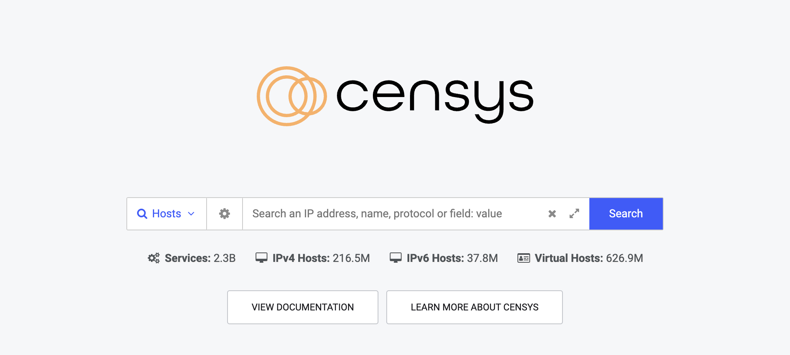
</p>

## Contributing

Found an awesome query? [Submit it here](https://github.com/thehappydinoa/awesome-censys-queries/issues/new?assignees=thehappydinoa&labels=query+submissions&template=query-submission.md&title=)

Interested in contributing in another way? [See the contributing guidelines](CONTRIBUTING.md)

## Key

- <a>🔎 &#x2192;</a> - This icon will take you to the Censys Search results page for the query.

## Table of Contents

<!-- markdownlint-disable MD004 MD005 MD007 MD032 -->

<!-- toc -->

  * [Industrial Control Systems](#industrial-control-systems)
  * [Internet of Things Devices](#internet-of-things-devices)
  * [Security Applications](#security-applications)
  * [Databases](#databases)
  * [Dashboards](#dashboards)
  * [Game Servers](#game-servers)
  * [Media Servers](#media-servers)
  * [Random Services](#random-services)
  * [Advanced Queries](#advanced-queries)
- [Credits](#credits)
- [License](#license)
- [Star History](#star-history)

<!-- tocstop -->

<!-- markdownlint-enable MD004 MD005 MD007 MD032 -->

### Industrial Control Systems

#### Industrial Control System Protocols [🔎 &#x2192;](https://search.censys.io/search?resource=hosts&q=services.service_name%3A+%7BBACNET%2C+CODESYS%2C+EIP%2C+FINS%2C+FOX%2C+IEC60870_5_104%2C+S7%2C+MODBUS%7D)

```dsl
services.service_name: {BACNET, CODESYS, EIP, FINS, FOX, IEC60870_5_104, S7, MODBUS}
```

#### Prismview (Samsung Electronic Billboards) [🔎 &#x2192;](https://search.censys.io/search?resource=hosts&q=services.tls.certificates.leaf_data.subject.common_name%3A+%22Prismview%22+or+services.http.response.headers.server%3A+%22Prismview+Player%22)

```dsl
services.tls.certificates.leaf_data.subject.common_name: "Prismview" or services.http.response.headers.server: "Prismview Player"
```

<details>
    <summary markdown="span">Screenshot</summary>
    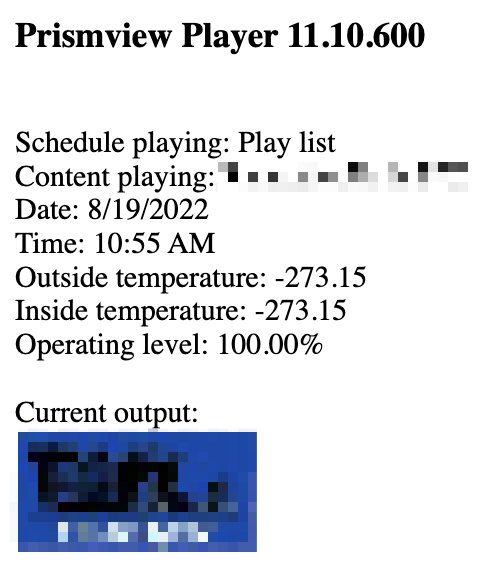
</details>

#### Gas Station Pump Controllers (ATGs) [🔎 &#x2192;](https://search.censys.io/search?resource=hosts&q=%28same_service%28port%3A+10001+and+banner%3A+%22IN-TANK+INVENTORY%22%29+or+services.service_name%3A+ATG%29+and+services.truncated%3A+false)

```dsl
(same_service(port: 10001 and banner: "IN-TANK INVENTORY") or services.service_name: ATG) and services.truncated: false
```

> **Pro-Tip**: Add `services.truncated: false` to your query to exclude honeypots (Hosts with 100+ services).

<details>
    <summary markdown="span">Screenshot</summary>
    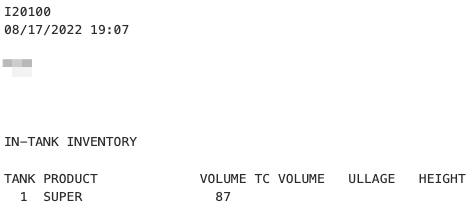
</details>

#### Electric Vehicle Chargers [🔎 &#x2192;](https://search.censys.io/search?resource=hosts&q=same_service%28http.response.headers.server%3A+%22gSOAP%2F2.8%22+and+http.response.headers.content_length%3A+583%29)

```dsl
same_service(http.response.headers.server: "gSOAP/2.8" and http.response.headers.content_length: 583)
```

#### Carel PlantVisor [🔎 &#x2192;](https://search.censys.io/search?resource=hosts&q=services.http.response.html_title%3A+%22CAREL+Pl%40ntVisor%22)

```dsl
services.http.response.html_title: "CAREL Pl@ntVisor"
```

<details>
    <summary markdown="span">References</summary>

- <https://www.carel.com/product/plantvisor>

</details>

#### C4 Max Vehicle GPS [🔎 &#x2192;](https://search.censys.io/search?resource=hosts&q=services.banner%3A+%22%5B1m%5B35mWelcome+on+console%22)

```dsl
services.banner: "[1m[35mWelcome on console"
```

<details>
    <summary markdown="span">References</summary>

- <https://wiki.neweagle.net/ProductDocumentation/Telematics/C4MAX_datasheet.pdf>

</details>

#### GaugeTech Electricity Meters [🔎 &#x2192;](https://search.censys.io/search?resource=hosts&q=services.http.response.headers.server%3A+%22EIG+Embedded+Web+Server%22)

```dsl
services.http.response.headers.server: "EIG Embedded Web Server"
```

<details>
    <summary markdown="span">Screenshot</summary>
    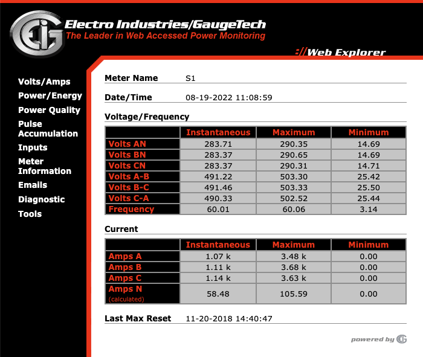
</details>

#### XZERES Wind Turbines [🔎 &#x2192;](https://search.censys.io/search?resource=hosts&virtual_hosts=INCLUDE&q=services.http.response.html_title%3A+%22XZERES+Wind%22)

```dsl
services.http.response.html_title: "XZERES Wind"
```

> **Note**: This query works best with virtual hosts included.

<details>
    <summary markdown="span">Screenshot</summary>
    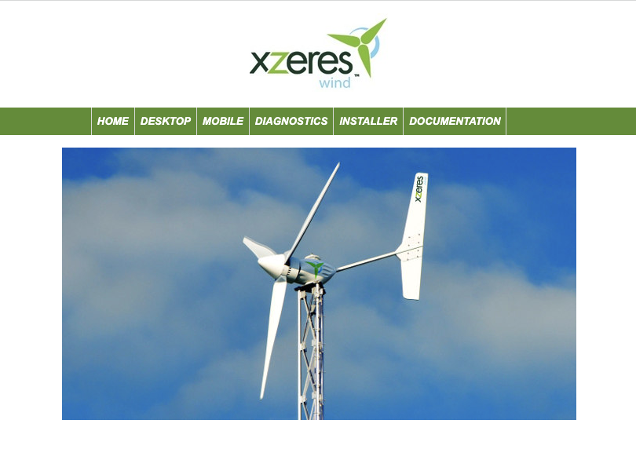
</details>

#### Nordex Wind Turbine Farms [🔎 &#x2192;](https://search.censys.io/search?resource=hosts&q=services.http.response.html_title%3A+%22Nordex+Control%22+or+services.tls.certificates.leaf_data.issuer.domain_component%3A+%22NORDEX-AG%22)

```dsl
services.http.response.html_title: "Nordex Control" or services.tls.certificates.leaf_data.issuer.domain_component: "NORDEX-AG"
```

<details>
    <summary markdown="span">References</summary>

- <https://www.cisa.gov/news-events/ics-alerts/ics-alert-10-307-01>

</details>

#### Saferoads VMS Signs [🔎 &#x2192;](https://search.censys.io/search?resource=hosts&q=services.http.response.html_title:%20%22Saferoads%20VMS%22)

```dsl
services.http.response.html_title: "Saferoads VMS"
```

<details>
    <summary markdown="span">References</summary>

- <https://www.saferoads.com.au/zone-vms>

</details>

### Internet of Things Devices

#### Roombas [🔎 &#x2192;](https://search.censys.io/search?resource=hosts&q=services.tls.certificates.leaf_data.issuer.common_name%3A+%22Roomba+CA%22)

```dsl
services.tls.certificates.leaf_data.issuer.common_name: "Roomba CA"
```

#### Mein Automowers [🔎 &#x2192;](https://search.censys.io/search?resource=hosts&q=services.http.response.headers.Www_Authenticate%3A+%60Basic+realm%3D+%22Mein+Automower+%28Robonect+Hx%2B%29%22%60)

```dsl
services.http.response.headers.Www_Authenticate: `Basic realm= "Mein Automower (Robonect Hx+)"`
```

#### WinAQMS Environmental Monitor [🔎 &#x2192;](https://search.censys.io/search?resource=hosts&q=services.banner%3A+%22WinAQMS+Data+Server%22+and+services.truncated%3A+false)

```dsl
services.banner: "WinAQMS Data Server" and services.truncated: false
```

#### Emerson Site Supervisor [🔎 &#x2192;](https://search.censys.io/search?resource=hosts&q=services.http.response.html_title%3A+%22Emerson+Site+Supervisor%22)

```dsl
services.http.response.html_title: "Emerson Site Supervisor"
```

<details>
    <summary markdown="span">Screenshot</summary>
    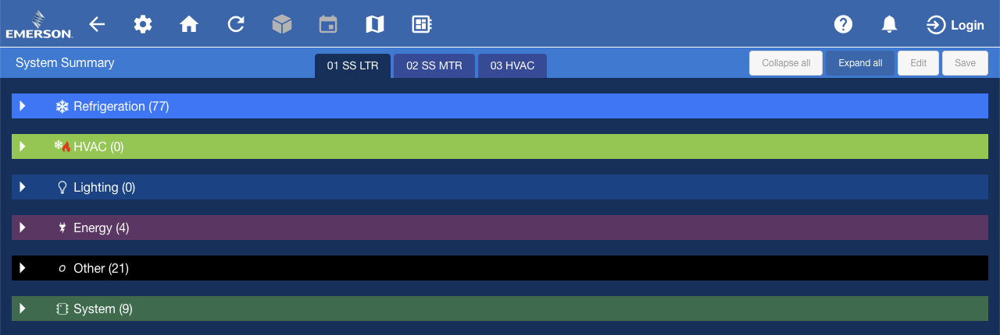
</details>

<details>
    <summary markdown="span">References</summary>

- <https://www.emerson.com/en-us/site-supervisor-5385648A>

</details>

#### Brightsign Digital Sign [🔎 &#x2192;](https://search.censys.io/search?resource=hosts&sort=RELEVANCE&per_page=25&q=services.http.response.html_title%3A+%22%27BrightSign%26reg%3B%22)

```dsl
services.http.response.html_title: "'BrightSign&reg;"
```

#### Elnet Power Meters [🔎 &#x2192;](https://search.censys.io/search?resource=hosts&sort=RELEVANCE&per_page=25&q=same_service%28services.http.response.headers.Server%3D%22CAL1.0%22+and+services.http.response.status_code%3A+200%29)

```dsl
same_service(services.http.response.headers.Server="CAL1.0" and services.http.response.status_code: 200)
```

<details>
    <summary markdown="span">Screenshot</summary>
    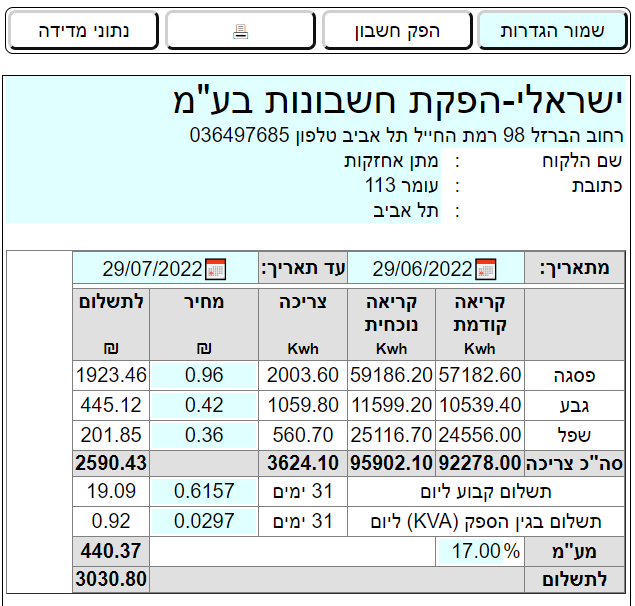
</details>

<details>
    <summary markdown="span">References</summary>

- <http://www.elnet.cc/>

</details>

#### Nethix Wireless Controller [🔎 &#x2192;](https://search.censys.io/search?resource=hosts&q=services.http.response.headers.set_cookie%3A+%22NethixSession%22)

```dsl
services.http.response.headers.set_cookie: "NethixSession"
```

<details>
    <summary markdown="span">References</summary>

- <https://nethix.com/en/>

</details>

#### Compromised Mikrotik Router [🔎 &#x2192;](https://search.censys.io/search?resource=hosts&q=services.service_name%3A+MIKROTIK_BW+and+%22hacked%22)

```dsl
services.service_name: MIKROTIK_BW and services.pptp.hostname: "HACKED"
```

<details>
    <summary markdown="span">References</summary>

- <https://thehackernews.com/2021/12/over-300000-mikrotik-devices-found.html>

</details>

### Security Applications

#### Cobalt Strike Servers [🔎 &#x2192;](https://search.censys.io/search?resource=hosts&q=services.certificate%3A+%7B%2264257fc0fac31c01a5ccd816c73ea86e639260da1604d04db869bb603c2886e6%22%2C+%2287f2085c32b6a2cc709b365f55873e207a9caa10bffecf2fd16d3cf9d94d390c%22%7D+or+services.tls.certificates.leaf_data.issuer.common_name%3A+%22Major+Cobalt+Strike%22+or+services.tls.certificates.leaf_data.subject.common_name%3A+%22Major+Cobalt+Strike%22+or+services.jarm.fingerprint%3A+%7B%2207d14d16d21d21d07c42d41d00041d24a458a375eef0c576d23a7bab9a9fb1%22%2C+%2207d14d16d21d21d00042d41d00041de5fb3038104f457d92ba02e9311512c2%22%7D)

```dsl
services.certificate: {
    "64257fc0fac31c01a5ccd816c73ea86e639260da1604d04db869bb603c2886e6",
    "87f2085c32b6a2cc709b365f55873e207a9caa10bffecf2fd16d3cf9d94d390c"
}
or services.tls.certificates.leaf_data.issuer.common_name: "Major Cobalt Strike"
or services.tls.certificates.leaf_data.subject.common_name: "Major Cobalt Strike"
```

#### Metasploit Servers [🔎 &#x2192;](https://search.censys.io/search?resource=hosts&q=services.http.response.html_title%3A+%22Metasploit%22+and+%28services.tls.certificates.leaf_data.subject.organization%3A+%22Rapid7%22+or+services.tls.certificates.leaf_data.subject.common_name%3A+%22MetasploitSelfSignedCA%22%29+or+services.jarm.fingerprint%3A+%7B07d14d16d21d21d00042d43d000000aa99ce74e2c6d013c745aa52b5cc042d%2C+07d14d16d21d21d07c42d43d000000f50d155305214cf247147c43c0f1a823%7D)

```dsl
services.http.response.html_title: "Metasploit" and (
    services.tls.certificates.leaf_data.subject.organization: "Rapid7"
    or services.tls.certificates.leaf_data.subject.common_name: "MetasploitSelfSignedCA"
)
or services.jarm.fingerprint: {
    "07d14d16d21d21d00042d43d000000aa99ce74e2c6d013c745aa52b5cc042d",
    "07d14d16d21d21d07c42d43d000000f50d155305214cf247147c43c0f1a823"
}
```

#### Nessus Scanner Servers [🔎 &#x2192;](https://search.censys.io/search?resource=hosts&q=services.http.response.headers.server%3A+%22NessusWWW%22+or+services.tls.certificates.leaf_data.subject.organizational_unit%3A+%22Nessus+Server%22)

```dsl
services.http.response.headers.server: "NessusWWW"
or services.tls.certificates.leaf_data.subject.organizational_unit: "Nessus Server"
```

#### NTOP Network Analyzers [🔎 &#x2192;](https://search.censys.io/search?resource=hosts&q=services.http.response.html_title%3A+%22Welcome+to+ntopng%22+or+same_service%28services.http.response.html_title%3A+%22Global+Traffic+Statistics%22+and+services.http.response.headers.server%3A+%22ntop%2F*%22%29)

```dsl
services.http.response.html_title: "Welcome to ntopng"
or same_service(
    services.http.response.html_title: "Global Traffic Statistics"
    and services.http.response.headers.server: "ntop/*"
)
```

#### Merlin C2 [🔎 &#x2192;](https://search.censys.io/search?resource=hosts&q=services.jarm.fingerprint%3A+29d21b20d29d29d21c41d21b21b41d494e0df9532e75299f15ba73156cee38)

```dsl
services.jarm.fingerprint: "29d21b20d29d29d21c41d21b21b41d494e0df9532e75299f15ba73156cee38"
```

<details>
    <summary markdown="span">References</summary>

- <https://github.com/Ne0nd0g/merlin>

</details>

#### Mythic C2 [🔎 &#x2192;](https://search.censys.io/search?resource=hosts&q=same_service%28port%3A+7443+and+tls.certificates.leaf_data.subject.organization%3A+%22Mythic%22%29)

```dsl
same_service(port: 7443 and tls.certificates.leaf_data.subject.organization: "Mythic")
```

> **Note**: When using the `same_service` operator, the initial `services.` prefix is optional.

<details>
    <summary markdown="span">References</summary>

- <https://github.com/its-a-feature/Mythic>
- <https://michaelkoczwara.medium.com/hunting-c2-with-shodan-223ca250d06f>

</details>

#### Deimos C2 [🔎 &#x2192;](https://search.censys.io/search?resource=hosts&q=services.jarm.fingerprint%3A+00000000000000000041d00000041d9535d5979f591ae8e547c5e5743e5b64)

```dsl
services.jarm.fingerprint: "00000000000000000041d00000041d9535d5979f591ae8e547c5e5743e5b64"
```

<details>
    <summary markdown="span">References</summary>

- <https://github.com/DeimosC2/DeimosC2>

</details>

#### Covenant C2 [🔎 &#x2192;](https://search.censys.io/search?resource=hosts&q=same_service%28http.response.body%3A+{%22Blazor%22,%20%22covenant.css%22}+and+tls.certificates.leaf_data.issuer.common_name%3A+%22Covenant%22%29)

```dsl
same_service(
    http.response.body: {"Blazor", "covenant.css"}
    and tls.certificates.leaf_data.issuer.common_name: "Covenant"
)
```

<details>
    <summary markdown="span">References</summary>

- <https://github.com/cobbr/Covenant>

</details>

#### PoshC2 [🔎 &#x2192;](https://search.censys.io/search?resource=hosts&q=same_service%28services.tls.certificates.leaf_data.subject.common_name%3D%22P18055077%22%20and%20services.tls.certificates.leaf_data.subject.province%3D%22Minnesota%22%20and%20services.tls.certificates.leaf_data.subject.locality%3D%22Minnetonka%22%20and%20services.tls.certificates.leaf_data.subject.organization%3D%22Pajfds%22%20and%20services.tls.certificates.leaf_data.subject.organizational_unit%3D%22Jethpro%22%29)

```dsl
same_service(
    services.tls.certificates.leaf_data.subject.common_name="P18055077" and
    services.tls.certificates.leaf_data.subject.province="Minnesota" and
    services.tls.certificates.leaf_data.subject.locality="Minnetonka" and
    services.tls.certificates.leaf_data.subject.organization="Pajfds" and
    services.tls.certificates.leaf_data.subject.organizational_unit="Jethpro"
)
```

<details>
    <summary markdown="span">References</summary>

- <https://github.com/nettitude/PoshC2>

</details>

#### Sliver C2 [🔎 &#x2192;](https://search.censys.io/search?resource=hosts&q=same_service%28%20services.tls.certificates.leaf_data.pubkey_bit_size%3A%202048%20and%20services.tls.certificates.leaf_data.subject.organization%3A%20%2F%28ACME%7CPartners%7CTech%7CCloud%7CSynergy%7CTest%7CDebug%29%3F%20%3F%28co%7Cllc%7Cinc%7Ccorp%7Cltd%29%3F%2F%20and%20services.jarm.fingerprint%3A%203fd21b20d00000021c43d21b21b43d41226dd5dfc615dd4a96265559485910%20and%20services.tls.certificates.leaf_data.subject.country%3A%20US%20and%20services.tls.certificates.leaf_data.subject.postal_code%3A%20%2F%3C1001-9999%3E%2F%20%29)

```dsl
same_service(
    services.tls.certificates.leaf_data.pubkey_bit_size: 2048 and
    services.tls.certificates.leaf_data.subject.organization: /(ACME|Partners|Tech|Cloud|Synergy|Test|Debug)? ?(co|llc|inc|corp|ltd)?/ and
    services.jarm.fingerprint: 3fd21b20d00000021c43d21b21b43d41226dd5dfc615dd4a96265559485910 and
    services.tls.certificates.leaf_data.subject.country: US and
    services.tls.certificates.leaf_data.subject.postal_code: /<1001-9999>/
)
```

> **Note**: This search uses regex and requires a paid account.
>
> **Pro-Tip**: Try removing JARM to find even more Sliver instances.

<details>
    <summary markdown="span">References</summary>

- <https://github.com/BishopFox/sliver>

</details>

#### EvilGinx2 [🔎 &#x2192;](https://search.censys.io/search?resource=hosts&q=services.jarm.fingerprint%3A+20d14d20d21d20d20c20d14d20d20daddf8a68a1444c74b6dbe09910a511e6)

```dsl
services.jarm.fingerprint: "20d14d20d21d20d20c20d14d20d20daddf8a68a1444c74b6dbe09910a511e6"
```

<details>
    <summary markdown="span">References</summary>

- <https://github.com/kgretzky/evilginx2>

</details>

#### Brute Ratel C4 [🔎 &#x2192;](https://search.censys.io/search?resource=hosts&q=services.http.response.body_hash%3A+%22sha1%3A1a279f5df4103743b823ec2a6a08436fdf63fe30%22)

```dsl
services.http.response.body_hash="sha1:1a279f5df4103743b823ec2a6a08436fdf63fe30"
```

<details>
    <summary markdown="span">References</summary>

- <https://bruteratel.com>

</details>

#### Empire C2 [🔎 &#x2192;](https://search.censys.io/search?resource=hosts&q=same_service(services.http.response.body_hash%3A+%7B%22sha1%3Abc517bf173440dad15b99a051389fadc366d5df2%22%2C+%22sha1%3Adcb32e6256459d3660fdc90e4c79e95a921841cc%22%7D+and+services.http.response.headers.expires%3A+0+and+services.http.response.headers.cache_control%3A+%22*%22))

```dsl
same_service(
    services.http.response.body_hash: {"sha1:bc517bf173440dad15b99a051389fadc366d5df2", "sha1:dcb32e6256459d3660fdc90e4c79e95a921841cc"}
    and services.http.response.headers.expires: 0
    and services.http.response.headers.cache_control: "*"
)
```

<details>
    <summary markdown="span">References</summary>

- <https://bc-security.gitbook.io/empire-wiki/>

</details>

#### Raccoon Stealer V2 (RecordBreaker C2) [🔎 &#x2192;](https://search.censys.io/search?resource=hosts&q=services.banner_hashes%3A+%22sha256%3A7987d0c39c4839572ab88c6d82da01395f74e0c31f12d94c58d0e1bed0b0c75c%22)

```dsl
services.banner_hashes: "sha256:7987d0c39c4839572ab88c6d82da01395f74e0c31f12d94c58d0e1bed0b0c75c"
```

<details>
    <summary markdown="span">References</summary>

- <https://twitter.com/1zrr4h/status/1593377638504087553>

</details>

#### NimPlant C2 [🔎 &#x2192;](https://search.censys.io/search?resource=hosts&q=services.http.response.headers.Server:%20%22NimPlant%20C2%20Server%22%20or%20services.http.response.body_hashes:%20%22sha256:636d68bd1bc19d763de95d0a6406f4f77953f9973389857353ac445e2b6fff87%22)

```dsl
services.http.response.headers.Server: "NimPlant C2 Server" or services.http.response.body_hashes: "sha256:636d68bd1bc19d763de95d0a6406f4f77953f9973389857353ac445e2b6fff87"
```

<details>
    <summary markdown="span">References</summary>

- <https://github.com/chvancooten/NimPlant>
- <https://twitter.com/chvancooten/status/1629911090774589442>

</details>

#### RedGuard [🔎 &#x2192;](https://search.censys.io/search?resource=hosts&q=services.tls.certificates.leaf_data.subject_dn%3A+%22C%3DCN%2C+L%3DHangZhou%2C+O%3DAlibaba+%28China%29+Technology+Co.%5C%5C%2C+Ltd.%2C+CN%3D%5C*.aliyun.com%22)

```dsl
services.tls.certificates.leaf_data.subject_dn: "C=CN, L=HangZhou, O=Alibaba (China) Technology Co.\\, Ltd., CN=\*.aliyun.com"
```

<details>
    <summary markdown="span">References</summary>

- <https://github.com/wikiZ/RedGuard>
- <https://github.com/wikiZ/RedGuard/blob/a49d862c79a447bc300865bde08aa37548326f5b/config/RedGuard_CobaltStrike.go>

</details>

#### AsyncRAT [🔎 &#x2192;](https://search.censys.io/search?resource=hosts&q=services.tls.certificates.leaf_data.subject.common_name%3A+%22AsyncRAT+Server%22)

```dsl
services.tls.certificates.leaf_data.subject.common_name: "AsyncRAT Server"
```

<details>
    <summary markdown="span">References</summary>

- <https://www.trendmicro.com/content/dam/trendmicro/global/en/research/21/i/ssl-tls-technical-brief/ssl-tls-technical-brief.pdf>

</details>

#### BitRAT [🔎 &#x2192;](https://search.censys.io/search?resource=hosts&q=services.tls.certificates.leaf_data.subject.common_name%3A+%22BitRAT%22)

```dsl
services.tls.certificates.leaf_data.subject.common_name: "BitRAT"
```

<details>
    <summary markdown="span">References</summary>

- <https://www.trendmicro.com/content/dam/trendmicro/global/en/research/21/i/ssl-tls-technical-brief/ssl-tls-technical-brief.pdf>

</details>

#### OrcusRAT [🔎 &#x2192;](https://search.censys.io/search?resource=hosts&q=services.tls.certificates.leaf_data.subject.common_name:%20{%22Orcus%20Server%22,%20%22OrcusServerCertificate%22})

```dsl
services.tls.certificates.leaf_data.subject.common_name: {"Orcus Server", "OrcusServerCertificate"}
```

<details>
    <summary markdown="span">References</summary>

- <https://www.trendmicro.com/content/dam/trendmicro/global/en/research/21/i/ssl-tls-technical-brief/ssl-tls-technical-brief.pdf>

</details>

#### QuasarRAT [🔎 &#x2192;](https://search.censys.io/search?resource=hosts&q=services.tls.certificates.leaf_data.subject.common_name:%20{%22Anony96%22,%20%22Quasar%20Server%20CA%22})

```dsl
services.tls.certificates.leaf_data.subject.common_name: {"Anony96", "Quasar Server CA"}
```

<details>
    <summary markdown="span">References</summary>

- <https://www.trendmicro.com/content/dam/trendmicro/global/en/research/21/i/ssl-tls-technical-brief/ssl-tls-technical-brief.pdf>

</details>

#### NanoCore [🔎 &#x2192;](https://search.censys.io/search?resource=hosts&q=services.tls.certificates.leaf_data.subject.common_name:%20%22unk%22)

```dsl
services.tls.certificates.leaf_data.subject.common_name: "unk"
```

<details>
    <summary markdown="span">References</summary>

- <https://www.trendmicro.com/content/dam/trendmicro/global/en/research/21/i/ssl-tls-technical-brief/ssl-tls-technical-brief.pdf>

</details>

#### DcRat [🔎 &#x2192;](https://search.censys.io/search?resource=hosts&q=services.tls.certificates.leaf_data.subject.common_name:%20%22DcRat%20Server%22)

```dsl
services.tls.certificates.leaf_data.subject.common_name: "DcRat Server"
```

<details>
    <summary markdown="span">References</summary>

- <https://www.trendmicro.com/content/dam/trendmicro/global/en/research/21/i/ssl-tls-technical-brief/ssl-tls-technical-brief.pdf>

</details>

#### Deimos C2 [🔎 &#x2192;](https://search.censys.io/search?resource=hosts&q=services.tls.certificates.leaf_data.subject_dn%3A+%22C%3DUS%2C+ST%3DMinnesota%2C+L%3DMinnetonka%2C+O%3DPajfds%2C+OU%3DJethpro%2C+CN%3DP18055077%22)

```dsl
same_service((services.http.response.html_title="Deimos C2" or services.tls.certificates.leaf_data.subject.organization="Acme Co") and services.port: 8443)
```

<details>
    <summary markdown="span">References</summary>

- <https://michaelkoczwara.medium.com/hunting-c2-with-shodan-223ca250d06f>
- <https://github.com/DeimosC2/DeimosC2/blob/2f368a5b151ea2da9f4fcc3627b1eb7d28b38fe5/c2/lib/certs/gen_cert.go>

</details>

#### Posh C2 [🔎 &#x2192;](https://search.censys.io/search?resource=hosts&q=same_service((services.http.response.html_title%3D%22Deimos+C2%22+or+services.tls.certificates.leaf_data.subject.organization%3D%22Acme+Co%22)+and+services.port%3A+8443))

```dsl
services.tls.certificates.leaf_data.subject_dn: "C=US, ST=Minnesota, L=Minnetonka, O=Pajfds, OU=Jethpro, CN=P18055077"
```

<details>
    <summary markdown="span">References</summary>

- <https://michaelkoczwara.medium.com/hunting-c2-with-shodan-223ca250d06f>
- <https://github.com/nettitude/PoshC2/blob/517903431ab43e6d714b24b0752ba111f5d4c2f1/poshc2/server/Config.py#L137>

</details>

#### IcedID Banking Trojan [🔎 &#x2192;](https://search.censys.io/search?resource=hosts&q=services.tls.certificates.leaf_data.subject_dn:%20%22CN=localhost,%20C=AU,%20ST=Some-State,%20O=Internet%20Widgits%20Pty%20Ltd%22)

```dsl
services.tls.certificates.leaf_data.subject_dn: "CN=localhost, C=AU, ST=Some-State, O=Internet Widgits Pty Ltd"
```

<details>
    <summary markdown="span">References</summary>

- <https://malware.news/t/melting-ice-tracking-icedid-servers-with-a-few-simple-steps/49525>
- <https://www.trendmicro.com/content/dam/trendmicro/global/en/research/21/i/ssl-tls-technical-brief/ssl-tls-technical-brief.pdf>

</details>

#### Gozi Malware [🔎 &#x2192;](https://search.censys.io/search?resource=hosts&q=services.tls.certificates.leaf_data.issuer_dn%3A+%22C%3DXX%2C+ST%3D1%2C+L%3D1%2C+O%3D1%2C+OU%3D1%2C+CN%3D%5C*%22)

```dsl
services.tls.certificates.leaf_data.issuer_dn: "C=XX, ST=1, L=1, O=1, OU=1, CN=\*"
```

<details>
    <summary markdown="span">References</summary>

- <https://www.trendmicro.com/content/dam/trendmicro/global/en/research/21/i/ssl-tls-technical-brief/ssl-tls-technical-brief.pdf>

</details>

#### Pupy RAT C2 [🔎 &#x2192;](https://search.censys.io/search?resource=hosts&q=same_service%28services.http.response.headers.Etag%3D%22%5C%22aa3939fc357723135870d5036b12a67097b03309%5C%22%22+AND+services.http.response.headers.Server%3D%22nginx%2F1.13.8%22%29+OR+same_service%28services.tls.certificates.leaf_data.issuer.organization%3A%2F%5Ba-zA-Z%5D%7B10%7D%2F+AND++services.tls.certificates.leaf_data.subject.organization%3A%2F%5Ba-zA-Z%5D%7B10%7D%2F+AND+services.tls.certificates.leaf_data.subject.organizational_unit%3D%22CONTROL%22%29)

```dsl
same_service(services.http.response.headers.Etag="\"aa3939fc357723135870d5036b12a67097b03309\"" and services.http.response.headers.Server="nginx/1.13.8") or same_service(services.tls.certificates.leaf_data.issuer.organization:/[a-zA-Z]{10}/ and  services.tls.certificates.leaf_data.subject.organization:/[a-zA-Z]{10}/ and services.tls.certificates.leaf_data.subject.organizational_unit="CONTROL")
```

> **Note**: This search uses regex and requires a paid account.

<details>
    <summary markdown="span">References</summary>

- <https://github.com/n1nj4sec/pupy>

</details>

#### Responder Server [🔎 &#x2192;](https://search.censys.io/search?resource=hosts&q=services.banner%3D%22HTTP%2F1.1+401+Unauthorized%5Cr%5CnServer%3A+Microsoft-IIS%2F7.5%5Cr%5CnDate%3A++%3CREDACTED%3E%5Cr%5CnContent-Type%3A+text%2Fhtml%5Cr%5CnWWW-Authenticate%3A+NTLM%5Cr%5CnContent-Length%3A+0%5Cr%5Cn%22)

```dsl
services.banner="HTTP/1.1 401 Unauthorized\r\nServer: Microsoft-IIS/7.5\r\nDate:  <REDACTED>\r\nContent-Type: text/html\r\nWWW-Authenticate: NTLM\r\nContent-Length: 0\r\n"
```

<details>
    <summary markdown="span">References</summary>

- <https://github.com/lgandx/Responder>
- <https://github.com/lgandx/Responder/blob/07c963f5ea52e27977ef603de180d446d009ed41/tools/MultiRelay/RelayMultiPackets.py#L93>

</details>

#### Open Directory Listing Host with Suspicious File Names in their Contents [🔎 &#x2192;](https://search.censys.io/search?resource=hosts&q=same_service%28%28services.http.response.html_title%3A%22Index+of+%2F%22+or+services.http.response.html_title%3A%22Directory+Listing+for+%2F%22%29+and+services.http.response.body%3A+%2F.*%3F%28cve%7Cmetasploit%7Ccobaltstrike%7Csliver%7Ccovenant%7Cbrc4%7Cbrute-ratel%7Ccommander-runme%7Cbruteratel%7Cps2exe%7C%28badger%7Cshellcode%7Csc%7Cbeacon%7Cartifact%7Cpayload%7Cteamviewer%7Canydesk%7Cmimikatz%7Ccs%7Crclone%29%5C.%28exe%7Cps1%7Cvbs%7Cbin%7Cnupkg%29%29.*%2F%29)

```dsl
same_service(
    (services.http.response.html_title:"Index of /" or services.http.response.html_title:"Directory Listing for /")
    and services.http.response.body: /.*?(cve|metasploit|cobaltstrike|sliver|covenant|brc4|brute-ratel|commander-runme|bruteratel|ps2exe|(badger|shellcode|sc|beacon|artifact|payload|teamviewer|anydesk|mimikatz|cs|rclone)\.(exe|ps1|vbs|bin|nupkg)).*/
)
```

> **Note**: This search uses regex and requires a paid account.

#### Splunk [🔎 &#x2192;](https://search.censys.io/search?resource=hosts&q=services.software.product%3A+%22Splunk%22)

```dsl
services.software.product: "Splunk"
```

<details>
    <summary markdown="span">References</summary>

- <https://www.splunk.com>

</details>

### Databases

#### Exposed CouchDB Servers [🔎 &#x2192;](https://search.censys.io/search?resource=hosts&q=services.http.response.body%3A+%27%22couchdb%22%3A+%22Welcome%22%27)

```dsl
services.http.response.body: '"couchdb": "Welcome"'
```

<details>
    <summary markdown="span">References</summary>

- <https://couchdb.apache.org/>

</details>

### Dashboards

#### cAdvisor Dashboards [🔎 &#x2192;](https://search.censys.io/search?resource=hosts&virtual_hosts=INCLUDE&q=same_service%28services.http.response.html_title%3D%60cAdvisor+-+%2F%60+and+services.http.response.status_code%3D200+and+services.http.request.uri%3D%22*%2Fcontainers%2F%22%29)

```dsl
same_service(services.http.response.html_title=`cAdvisor - /` and services.http.response.status_code=200 and services.http.request.uri="*/containers/")
```

<details>
    <summary markdown="span">References</summary>

- <https://github.com/google/cadvisor>

</details>

#### HashiCorp Consul Dashboards [🔎 &#x2192;](https://search.censys.io/search?resource=hosts&virtual_hosts=INCLUDE&q=same_service%28services.http.response.html_title%3D%60Consul+by+HashiCorp%60+and+services.http.request.uri%3A+%22*%2Fui%2F%22%29)

```dsl
same_service(services.http.response.html_title=`Consul by HashiCorp` and services.http.request.uri: "*/ui/")
```

<details>
    <summary markdown="span">References</summary>

- <https://www.consul.io/>

</details>

#### Netdata Dashboards [🔎 &#x2192;](https://search.censys.io/search?resource=hosts&virtual_hosts=INCLUDE&q=same_service%28services.http.response.headers.Server%3D%22Netdata+Embedded+HTTP*%22+and+services.http.response.html_title%3D%22netdata+dashboard%22%29)

```dsl
same_service(services.http.response.headers.Server="Netdata Embedded HTTP*" and services.http.response.html_title="netdata dashboard")
```

<details>
    <summary markdown="span">References</summary>

- <https://www.netdata.cloud/>

</details>

#### Rancher Dashboards [🔎 &#x2192;](https://search.censys.io/search?resource=hosts&virtual_hosts=INCLUDE&q=same_service%28services.http.response.headers.unknown.name%3A+%22X-Rancher-Version%22+and+services.http.response.html_title%3A+%22Loading%26hellip%3B%22%29)

```dsl
same_service(services.http.response.headers.unknown.name: "X-Rancher-Version" and services.http.response.html_title: "Loading&hellip;")
```

#### Traefik Dashboards [🔎 &#x2192;](https://search.censys.io/search?resource=hosts&q=same_service%28services.http.request.uri%3A+%22*%2Fdashboard%2F%22+and+services.http.response.html_title%3A+%22Traefik%22%29)

```dsl
same_service(services.http.request.uri: "*/dashboard/" and services.http.response.html_title: "Traefik")
```

<details>
    <summary markdown="span">References</summary>

- <https://github.com/traefik/traefik>

</details>

#### Weave Scope [🔎 &#x2192;](https://search.censys.io/search?resource=hosts&q=same_service%28services.http.response.html_title%3A+%22Weave+Scope%22+and+services.http.response.body%3D%22*WEAVEWORKS_CSRF*%22%29)

```dsl
same_service(services.http.response.html_title: "Weave Scope" and services.http.response.body="*WEAVEWORKS_CSRF*")
```

<details>
    <summary markdown="span">References</summary>

- <https://www.weave.works/oss/scope/>

</details>

### Game Servers

#### Counter-Strike: Global Offensive [🔎 &#x2192;](https://search.censys.io/search?resource=hosts&q=same_service%28banner%3A+%22Counter-Strike%3A+Global+Offensive+Server%22+and+service_name%3A+VALVE%29)

```dsl
same_service(banner: "Counter-Strike: Global Offensive Server" and service_name: VALVE)
```

### Media Servers

#### Plex Media Server [🔎 &#x2192;](https://search.censys.io/search?resource=hosts&q=services.http.response.headers.unknown.name%3A+%22X-Plex-Protocol%22)

```dsl
services.http.response.headers.unknown.name: "X-Plex-Protocol"
```

<details>
    <summary markdown="span">References</summary>

- <https://plex.tv/>

</details>

#### MythWeb [🔎 &#x2192;](https://search.censys.io/search?resource=hosts&q=services.http.request.uri%3A+%22mythweb%22)

```dsl
services.http.request.uri: "mythweb"
```

<details>
    <summary markdown="span">Screenshot</summary>
    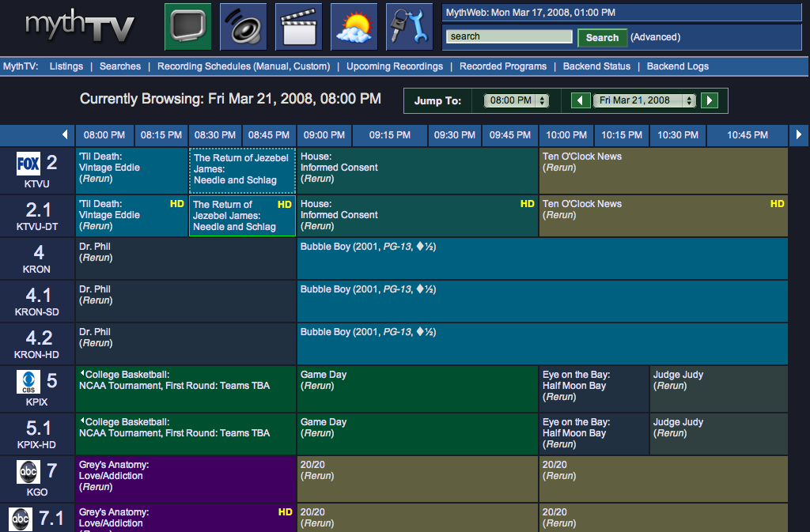
</details>

<details>
    <summary markdown="span">References</summary>

- <https://github.com/MythTV/mythweb>

</details>

### Random Services

#### Hosts emitting GNSS payloads [🔎 &#x2192;](https://search.censys.io/search?resource=hosts&q=services.banner%3A+%22%24GPRMC%22)

```dsl
services.banner: "$GPRMC"
```

#### Directory Listing [🔎 &#x2192;](https://search.censys.io/search?resource=hosts&q=services.http.response.html_title%3A+%22Index+of+%2F%22)

```dsl
services.http.response.html_title: "Index of /"
```

#### Swagger UI [🔎 &#x2192;](https://search.censys.io/search?resource=hosts&q=services.http.response.html_title%3A+%22Swagger+UI+-+%22)

```dsl
services.http.response.html_title: "Swagger UI - "
```

<details>
    <summary markdown="span">Screenshot</summary>
    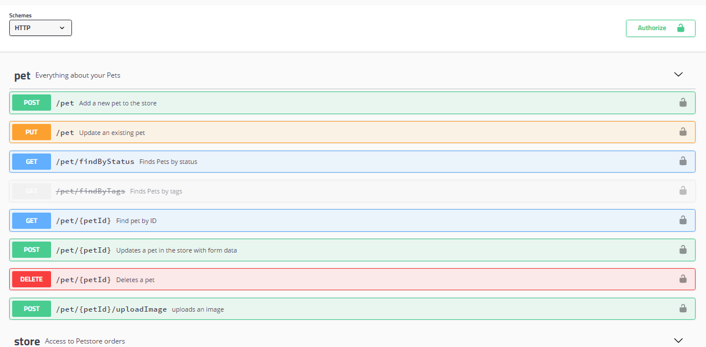
</details>

<details>
    <summary markdown="span">References</summary>

- <https://swagger.io/tools/swagger-ui/>

</details>

#### Mongo Express Admin Interface [🔎 &#x2192;](https://search.censys.io/search?resource=hosts&q=services.http.response.html_title%3A+%22Home+-+Mongo+Express%22)

```dsl
services.http.response.html_title: "Home - Mongo Express"
```

<details>
    <summary markdown="span">References</summary>

- <https://github.com/mongo-express/mongo-express>

</details>

#### shell2http [🔎 &#x2192;](https://search.censys.io/search?resource=hosts&sort=RELEVANCE&per_page=25&virtual_hosts=INCLUDE&q=services.http.response.html_title%3A+%22shell2http%22&cursor=eyJBZnRlciI6WyIyMS4yOTIxMzEiLCJBaTJPMzhHWlRtN2ZrUTFCdERPOUp3PT0iXSwiUmV2ZXJzZSI6ZmFsc2UsIlNlZWQiOjB9)

```dsl
services.http.response.html_title: "shell2http"
```

#### Busybox Shells [🔎 &#x2192;](https://search.censys.io/search?resource=hosts&q=same_service%28services.banner%3A+%22Enter+%27help%27+for+a+list+of+built-in+commands%22+and+services.service_name%3A+TELNET%29+and+services.truncated%3A+false)

```dsl
same_service(services.banner: "Enter 'help' for a list of built-in commands" and services.service_name: TELNET) and services.truncated: false
```

<details>
    <summary markdown="span">Screenshot</summary>
    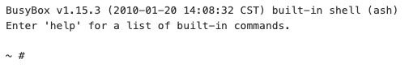
</details>

#### Unauthenticated Redis Servers [🔎 &#x2192;](https://search.censys.io/search?resource=hosts&q=services.redis.ping_response%3A+%22PONG%22)

```dsl
services.redis.ping_response: "PONG"
```

#### Misconfigured Kubernetes Installations [🔎 &#x2192;](https://search.censys.io/search?resource=hosts&q=services.kubernetes.pod_names%3A+*)

```dsl
services.kubernetes.pod_names: *
```

#### Misconfigured WordPress [🔎 &#x2192;](https://search.censys.io/search?resource=hosts&q=services.http.response.body%3A+%22The+wp-config.php+creation+script+uses+this+file%22)

```dsl
services.http.response.body: "The wp-config.php creation script uses this file"
```

#### Unconfigured AdGuard [🔎 &#x2192;](https://search.censys.io/search?resource=hosts&virtual_hosts=INCLUDE&q=same_service%28services.http.response.html_title%3A+%22Setup+AdGuard+Home%22+and+services.http.request.uri%3D%22*%2Finstall.html%22%29)

```dsl
same_service(services.http.response.html_title: "Setup AdGuard Home" and services.http.request.uri="*/install.html")
```

<details>
    <summary markdown="span">References</summary>

- <https://adguard.com/en/welcome.html>

</details>

#### Prometheus Node Exporters [🔎 &#x2192;](https://search.censys.io/search?resource=hosts&q=same_service%28services.http.response.html_title%3A+%22node+exporter%22+and+services.http.response.body%3A+%22%2Fmetrics%22%29)

```dsl
same_service(services.http.response.html_title: "node exporter" and services.http.response.body: "/metrics")
```

#### VictoriaMetrics Agent [🔎 &#x2192;](https://search.censys.io/search?resource=hosts&q=services.http.response.body%3A+%22%3Ch2%3Evmagent%3C%2Fh2%3E%22)

```dsl
services.http.response.body: "<h2>vmagent</h2>"
```

<details>
    <summary markdown="span">Screenshot</summary>
    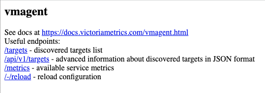
</details>

<details>
    <summary markdown="span">References</summary>

- <https://docs.victoriametrics.com/vmagent.html>

</details>

#### SonarQube [🔎 &#x2192;](https://search.censys.io/search?resource=hosts&q=same_service%28http.response.html_title%3A+%22SonarQube%22+and+http.response.status_code%3A+200+and+http.response.protocol%09%3A+%22HTTP%2F1.1%22%29)

```dsl
same_service(http.response.html_title: "SonarQube" and http.response.status_code: 200 and http.response.protocol: "HTTP/1.1")
```

<details>
    <summary markdown="span">References</summary>

- <https://www.sonarqube.org/>

</details>

### Advanced Queries

#### Honeypots Hosts [🔎 &#x2192;](https://search.censys.io/search?resource=hosts&q=services.truncated%3A+true)

```dsl
services.truncated: true
```

#### North Korean Hosts [🔎 &#x2192;](https://search.censys.io/search?resource=hosts&q=location.country%3A+%22North+Korea%22)

```dsl
location.country: "North Korea"
```

#### Hosts that identify as US government or military [🔎 &#x2192;](https://search.censys.io/search?resource=hosts&q=dns.names%3A+*.gov+or+dns.names%3A+*.mil+or+name%3A+*.gov+or+name%3A+*.mil)

```dsl
dns.names: *.gov or dns.names: *.mil or name: *.gov or name: *.mil
```

#### Services Listening on 53 that are not DNS [🔎 &#x2192;](https://search.censys.io/search?resource=hosts&q=same_service%28services.port%3A+53+and+not+services.service_name%3A+DNS%29+and+services.truncated%3A+false)

```dsl
same_service(services.port: 53 and not services.service_name: DNS) and services.truncated: false
```

> Alternative syntax without the `services.` prefix inside the `same_service` function:
>
> ```dsl
> same_service(port: 53 and not service_name: DNS) and services.truncated: false
> ```

#### Non-Standard Services Listening on Common Ports [🔎 &#x2192;](https://search.censys.io/search?resource=hosts&q=same_service%28services.port%3A+%7B21%2C+22%2C+80%7D+and+not+services.service_name%3A+%7BHTTP%2C+SSH%2C+FTP%2C+UNKNOWN%7D%29+and+services.truncated%3A+false)

```dsl
same_service(services.port: {21, 22, 80} and not services.service_name: {HTTP, SSH, FTP, UNKNOWN}) and services.truncated: false
```

#### Services Listening on Port 22 that are not SSH [🔎 &#x2192;](https://search.censys.io/search?resource=hosts&q=same_service%28not+services.service_name%3A+%7BSSH%7D+and+services.port%3A+22+and+not+services.banner%3A+%7B%22Connection+refused%22%2C+%22SSH-%22%2C+%22Exceeded+MaxStartups%22%2C+%22Too+many+users%22%2C+%22Connection+closed+by+server%22%7D%29+and+services.truncated%3A+false)

```dsl
same_service(services.port: 22 and not services.service_name: {SSH} and not services.banner: {"Connection refused", "SSH-", "Exceeded MaxStartups", "Too many users", "Connection closed by server"}) and services.truncated: false
```

#### Services Listening on 80 or 443 that are not HTTP or HTTPS (or UNKNOWN with TLS) [🔎 &#x2192;](https://search.censys.io/search?resource=hosts&q=not+same_service%28services.port%3A+443+and+services.name%3A+UNKNOWN+and+services.tls.certificates.leaf_data.subject_dn%3A+*+%29+and+same_service%28services.port%3A+%7B80%2C+443%7D+and+not+services.service_name%3A+%7BKUBERNETES%2C+ANYCONNECT%2C+OPENVPN%2C+HTTP%7D+and+not+services.banner%3A+%E2%80%9CHTTP%2F%E2%80%9D+%29++and+services.truncated%3A+false)

```dsl
not same_service(services.port: 443 and services.name: UNKNOWN and services.tls.certificates.leaf_data.subject_dn: *) and same_service(services.port: {80, 443} and not services.service_name: {KUBERNETES, ANYCONNECT, OPENVPN, HTTP} and not services.banner: “HTTP/”) and services.truncated: false
```

## Credits

- [jakejarvis/awesome-shodan-queries](https://github.com/jakejarvis/awesome-shodan-queries)
- [woj-ciech/Kamerka-GUI](https://github.com/woj-ciech/Kamerka-GUI)
- [salesforce/jarm](https://github.com/salesforce/jarm)
- [cedowens/C2-JARM](https://github.com/cedowens/C2-JARM)
- [emilyaustin/censys-resources](https://github.com/emilyaustin/censys-resources)
- [drb-ra](https://github.com/drb-ra)
- [The State of SSL/TLS Certificate Usage in Malware C&C Communications](https://www.trendmicro.com/content/dam/trendmicro/global/en/research/21/i/ssl-tls-technical-brief/ssl-tls-technical-brief.pdf)
- [Hunting C2 - Michael Koczwara](https://michaelkoczwara.medium.com/hunting-c2-with-shodan-223ca250d06f)

## License

[](https://creativecommons.org/publicdomain/zero/1.0/)

## Star History

[](https://star-history.com/#thehappydinoa/awesome-censys-queries&Date)
